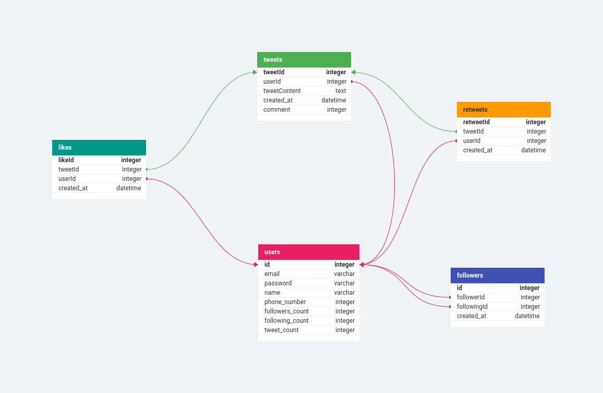

# Twitter-Like Application Database Schema

This repository contains the normalized database schema for a Twitter-like application. The schema is designed to meet the following requirements:

1. Users can register with their name, email, and phone number.
2. Users can tweet any textual content.
3. Users can like another user's tweet.
4. Users can retweet another user's tweet.
5. Users can comment on another user's tweet (comments are treated as tweets).
6. Users can follow other users.

## Database Schema Overview

## Entity Descriptions

### users
- **Attributes:**
  - `id` (Primary Key)
  - `email`
  - `password`
  - `name`
  - `phone_number`
  - `followers_count`
  - `following_count`
  - `tweet_count`

### tweets
- **Attributes:**
  - `tweetId` (Primary Key)
  - `userId` (Foreign Key referencing User)
  - `tweetContent`
  - `created_at`
  - `comment`

### likes
- **Attributes:**
  - `likeId` (Primary Key)
  - `userId` (Foreign Key referencing User)
  - `tweetId` (Foreign Key referencing Tweet)
  - `created_at`

### Retweet
- **Attributes:**
  - `retweetId` (Primary Key)
  - `userId` (Foreign Key referencing User)
  - `tweetId` (Foreign Key referencing Tweet)
  - `created_at`

### followers
- **Attributes:**
  - `id` (Primary Key)
  - `followerId` (Foreign Key referencing User)
  - `followingId` (Foreign Key referencing User)
  - `created_at`

## Relationships

- One-to-Many relationship between User and Tweet (one user can have multiple tweets).
- Many-to-Many relationship between User and User (through Follower table for followers/following).
- One-to-Many relationship between User and Like (one user can like multiple tweets).
- One-to-Many relationship between User and Retweet (one user can retweet multiple tweets).
- One-to-Many relationship between User and Comment (one user can comment on multiple tweets).

## Tools Used

The database schema diagram was created using [dbdesigner.net](https://www.dbdesigner.net)(Links to an external site).
